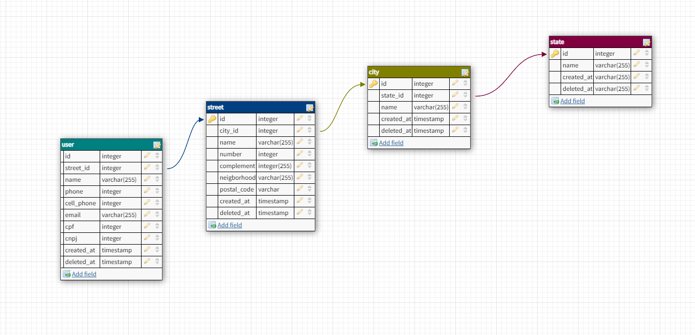

## Backend - Wefit

Seja bem vindo ao teste de backend da Wefit.

### Para iniciar o banco de dados é necessario ter o docker-compose instalado em sua máquina e rodar o seguinte comando:

    docker-compose up -D

o docker-compose vai criar um container de um MySQL e a estrutura de tabelas necessarias, você poderá acessar via localhost:3306 e a senha do usuário **root** é **senha_root_123**

### Para iniciar o servidor express basta executar o seguinte comando:

    npm start
    ou
    yarn start

### Modelagem do banco de dados.

Ao criar três tabelas separadas para armazenar informações de endereço do usuário - "street" (logradouro), "city" (cidade) e "state" (estado) - optei por adotar uma abordagem de normalização de banco de dados. Esta abordagem foi escolhida para evitar redundâncias nos dados e garantir uma estrutura de banco de dados mais eficiente e organizada.

Quanto à decisão de não criar uma tabela separada para bairros, isso pode ser justificado pelo fato de que os nomes de bairros podem variar bastante e não possuem uma padronização amplamente aceita. Ao invés disso, é comum incluir o nome do bairro como parte do endereço da rua na tabela "street", o que pode ser mais prático e flexível para lidar com essas variações.



### Rotas da API e Funcionalidades.

#### 1. Criação de Perfil de Usuário
- POST `/user/profile`
  Cria o perfil de um usuário.
    ```
        body: { 
            "user_name": "João",
            "cnpj": "209238493894",
            "cpf": "470.278.570-22",
            "cell_phone":  "(55) 12 998767-0954",
            "email": "joao@gmail.com",
            "confirm_email": "joao@gmail.com",
            "state_name": "São paulo",
            "postal_code": "12246021",
            "street_name": "Rua 1",
            "number": 1,
            "city_name": "São Jose dos Campos",
            "neighborhood": "Bairro 2"
        }
  ```
#### 2. Listagem de Perfis de Usuários
- GET `/user/profiles`
Retorna todos os perfis de usuários cadastrados.

#### 3. Obter Perfil de Usuário por ID
- GET `/user/:id/profile`
  Retorna o perfil de um usuário específico, identificado pelo parâmetro :id.

